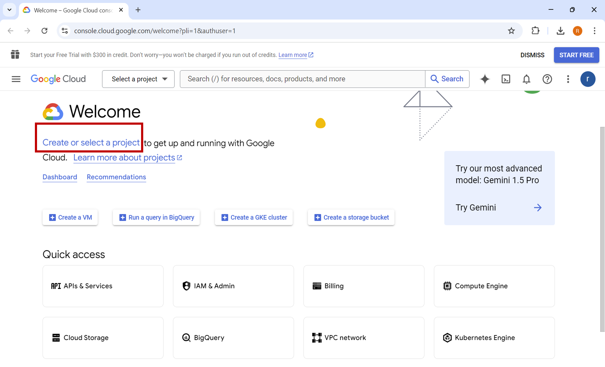
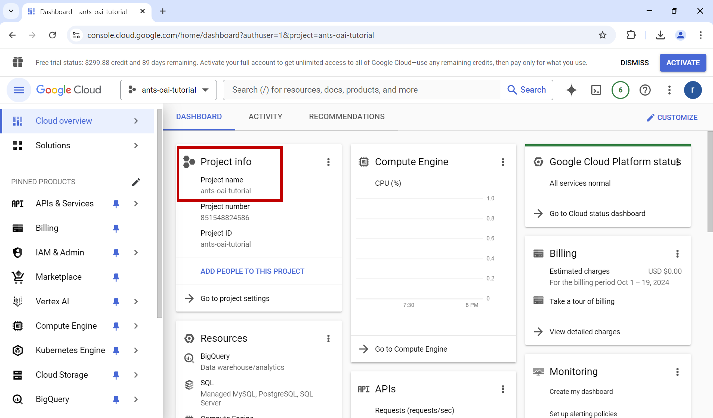

<table style="border-collapse: collapse; border: none;">
  <tr style="border-collapse: collapse; border: none;">
    <td style="border-collapse: collapse; border: none;">
      <a href="http://www.openairinterface.org/">
         
         </img>
      </a>
    </td>
    <td style="border-collapse: collapse; border: none; vertical-align: center;">
      <b>Virtual Machine Creation in Google Cloud Platform for Running OAI</b>
    </td>
  </tr>
</table>

#  1. Introduction
This tutorial describes the steps in creating a virtual machine (VM) on the Google Cloud Platform (GCP). The VM can run an end-to-end 5G network based on the OpenAirInterface (OAI) software stack in an RF simulated (RFsim) mode. 

## 1.1 Prerequisites
Before you begin, make sure you have an access to your GCP account. If you do not have one, you can sign up with your google account at   [https://cloud.google.com/](https://cloud.google.com)

Depending on the country you are located, generally you have some free credits to try the GCP products. If you haven't used them already, these free credits would be enough to have a hands-on experience with OAI for few days.

## 1.2 Computing Requirements
To run an end-to-end 5G network with OAI Core Network (CN),
Radio Access Network (RAN) including base station (gNB) and user equipment (nrUE) in a RFsim, we should have the following minimum recommended computing requirements: 
-  Operating System: Ubuntu 22.04 LTS
-  CPU: 8 cores x86_64 @ 3.5 GHz
- RAM: 32 GB

We will now create a VM on the GCP that satisfies these requirements.

# 2. VM Creation

Step 1:  Accessing the console and creating a project
1.  Open your web browser and login to [https://console.cloud.google.com/](https://console.cloud.google.com/).
2.  If you are using for the GCP for the first time, you will not any projects. If you don’t have a project yet, you can create a new project and then select it.

If you already have projects and are familier with GCP you can select any of your project.

3. After succesfull project creation, the project dashboard looks like this with your given project name 

 
 
 Step 2:  Creating a VM Instance
 
1. Select the "Compute Engine" and then "VM instances" to create a new VM instance from your project dashboard.
2. Click on the "CREATE INSTANCE" button
3. 
   
 
  

Step 4: Creating a VM Instance
1. Choosing server location and general purpose
2. Create a custom Machine type
3. CPU platform must be x86 based 
4. Boot disk changes...ubuntu 22.04, 12 GB space
5. Firewall allow traffic 
6. Advanced options and networking enable IP forwarding 
7. VM instances status bar. When you are not using it you can pause so you do not consume you credits. However, do not delete till you are done with this tutorial or your project. Otherwise, you have to re-create another VM follwing all steps from 1.
Step 5: 
